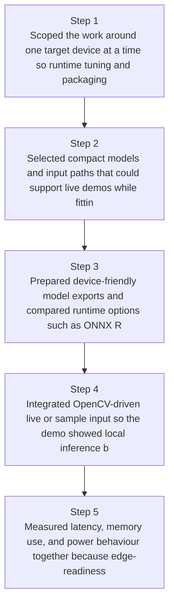
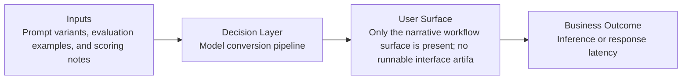
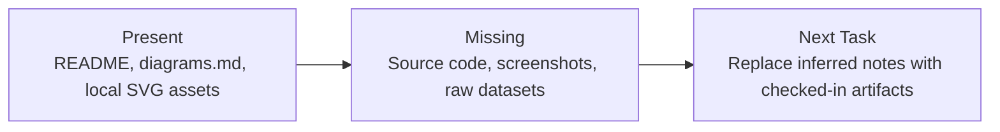

# Edge AI Runtime Evaluation Diagrams

Generated on 2026-04-26T04:29:37Z from README narrative plus project blueprint requirements.

## Runtime comparison bar chart (latency/memory/power)

## Model conversion pipeline

## Evidence Gap Map

